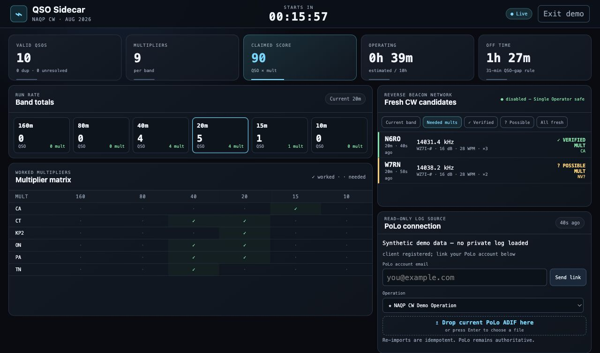

# QSO Sidecar

A local, read-only companion dashboard for [Ham2K PoLo](https://polo.ham2k.com/docs/)
during the August 2026 NAQP CW contest. It adds claimed-score tracking, a per-band
multiplier matrix, LoFi synchronization or ADIF import, and optional live
[Reverse Beacon Network](https://reversebeacon.net/) candidates. PoLo remains the source
of truth: QSO Sidecar never creates or edits contacts.

A single stable Rust binary serves embedded HTML, CSS, and JavaScript on `127.0.0.1`.
The dashboard loads no third-party frontend assets at runtime.



## Install a prebuilt release

[Tagged releases](https://github.com/rwjblue/qso-sidecar/releases) provide unsigned,
self-contained archives that do not require Rust, mise, Bash, or WSL:

| System | Target |
| --- | --- |
| Windows 10/11 x64 | `x86_64-pc-windows-msvc` |
| Apple Silicon macOS | `aarch64-apple-darwin` |
| Intel macOS | `x86_64-apple-darwin` |
| Linux x64 | `x86_64-unknown-linux-musl` |

On Windows PowerShell, replace `0.1.0` with the release version:

```powershell
$Version = "0.1.0"
$Archive = "qso-sidecar-v$Version-x86_64-pc-windows-msvc.zip"
$Base = "https://github.com/rwjblue/qso-sidecar/releases/download/v$Version"
Invoke-WebRequest "$Base/$Archive" -OutFile $Archive
Invoke-WebRequest "$Base/SHA256SUMS.txt" -OutFile SHA256SUMS.txt
$Expected = ((Select-String -Path SHA256SUMS.txt -Pattern $Archive).Line -split "\s+")[0]
$Actual = (Get-FileHash -Algorithm SHA256 $Archive).Hash
if ($Actual -ne $Expected) { throw "SHA-256 checksum mismatch" }
Expand-Archive $Archive -DestinationPath qso-sidecar
./qso-sidecar/qso-sidecar.exe
```

On macOS, choose the target automatically and verify with `shasum`:

```bash
version=0.1.0
if [[ "$(uname -m)" == arm64 ]]; then target=aarch64-apple-darwin; else target=x86_64-apple-darwin; fi
archive="qso-sidecar-v${version}-${target}.tar.gz"
base="https://github.com/rwjblue/qso-sidecar/releases/download/v${version}"
curl -LO "$base/$archive" -LO "$base/SHA256SUMS.txt"
grep "  $archive$" SHA256SUMS.txt | shasum -a 256 -c -
tar -xzf "$archive"
./qso-sidecar
```

On Linux x64, use the musl archive and `sha256sum`:

```bash
version=0.1.0
archive="qso-sidecar-v${version}-x86_64-unknown-linux-musl.tar.gz"
base="https://github.com/rwjblue/qso-sidecar/releases/download/v${version}"
curl -LO "$base/$archive" -LO "$base/SHA256SUMS.txt"
grep "  $archive$" SHA256SUMS.txt | sha256sum -c -
tar -xzf "$archive"
./qso-sidecar
```

Then open <http://127.0.0.1:7878>. Releases are intentionally not code-signed or
notarized, so Windows SmartScreen and macOS Gatekeeper may warn on first launch. Verify
the SHA-256 checksum before using **More info → Run anyway** on Windows or
**Control-click → Open** on macOS. See Microsoft's
[SmartScreen guidance](https://learn.microsoft.com/en-us/windows/apps/package-and-deploy/smartscreen-reputation)
and Apple's [Gatekeeper guidance](https://support.apple.com/en-us/102445).

To upgrade, stop Sidecar and replace the extracted binary. The per-user LoFi identity,
credentials, and last-good log snapshot remain in the OS application-data directory.

## Quick start

Install [mise](https://mise.jdx.dev/); it installs the stable Rust toolchain configured
by this repository. Then run:

```bash
mise run build
mise run start
```

Open <http://127.0.0.1:7878>. To exercise the entire UI without showing a real log:

```bash
mise run start -- --demo
```

Failure-state demos are also built in. For example:

```bash
mise run start -- --demo --demo-scenario unresolved-exchange
```

Available scenarios are `normal`, `no-log`, `stale-adif`, `lofi-unavailable`,
`rbn-disconnected`, `malformed-import`, and `unresolved-exchange`.

Development and verification tasks:

```bash
mise run dev -- --demo
mise run check
mise run build
```

GitHub Actions runs `mise run check` and `mise run build` for every pull request and
push to `main`, using the same repository-managed stable Rust toolchain as local
development. CI caches Cargo registry, Git checkout, and build data using only the
runner platform and `Cargo.lock`; it does not depend on a developer machine's state.

## Connect to PoLo through LoFi

1. Start Sidecar and open <http://127.0.0.1:7878>.
2. In **PoLo connection**, enter the email address attached to the Ham2K account and
   choose **Send link**.
3. Open the verification email and follow its Ham2K link. Leave Sidecar running; it
   polls the linked-account status every eight seconds.
4. Once linked, Sidecar fetches recent operations and automatically prefers the current
   operation containing a `naqp` reference. If needed, choose another operation from
   the dropdown.
5. Sidecar fetches all pages of that operation's QSOs, then polls incrementally every
   30 seconds. Updates and tombstones replace prior records by QSON UUID.

The random LoFi client key, secret, and bearer token are stored only in the OS per-user
application-data directory. The directory is mode `0700` and the credential file is
mode `0600` on Unix. They are never sent to browser JavaScript or written to logs.

Sidecar also atomically stores the last successful normalized log snapshot in that
directory and restores it on restart before synchronizing. See
[`docs/polo-integration.md`](docs/polo-integration.md) for source, recovery, and
privacy details.

## ADIF fallback

In PoLo, export the current operation as ADIF. Drag the `.adi`/`.adif` file onto the
dashboard's import target, or focus it and press Enter to select a file. The parser uses
`CALL`, `QSO_DATE`, `TIME_ON`, `BAND`/`FREQ`, `MODE`, `NAME`, `STATE`, `COUNTRY`, `DXCC`,
`CONTEST_ID`, and `SRX_STRING`. PoLo's `SRX_STRING` form (`<name> <location>`) is used as
an exchange fallback. Re-importing a growing snapshot is idempotent.

## N1MM Call History

Export or prepare an N1MM Call History text file with an `!!Order!!` header and drop it
onto the dashboard's Call History target. Sidecar maps `Call`, `Name`, and `State` by
column name, accepts comma- or semicolon-delimited files, ignores comments and unknown
columns, and reports malformed rows without discarding usable entries.

Call History is static historical evidence. Its names and locations are exposed as
**history** predictions, never proof that a callsign is participating in the current
contest. An exchange from a completed local QSO always takes precedence, while a
conflicting historical value remains visible in the API evidence. The imported history
is held for the current Sidecar session and can be replaced atomically by importing a
new file.

## Live CW spots and entry category

Sidecar does not connect to a spotting network by default, keeping its normal startup
safe for an unassisted Single Operator entry. To explicitly enable RBN, supply both
`--rbn` and a login callsign:

```bash
QSO_SIDECAR_CALL=N1RWJ mise run start -- --rbn
```

**NAQP prohibits spotting/skimmer assistance for the Single Operator category.** Using
the live candidate panel means entering Single Operator Assisted. Sidecar opens no RBN
connection unless `--rbn` (or `QSO_SIDECAR_RBN=true`) is explicitly set, and the
dashboard shows a persistent warning whenever spots are enabled. The former `--no-rbn`
option has been removed because disabled is now the default.

Sidecar evaluates entry-category implications across every source, not just RBN. Source
capabilities distinguish live external assistance, static history, local logs, and
offline references. Any enabled live external source triggers the assisted-category
warning; disabling RBN cannot suppress that warning while another live feed is active.
Static user-imported history, PoLo/ADIF log data, and the bundled rules catalog do not by
themselves require an assisted entry. The dashboard lists each active source and its
capability.

Spots never award QSO or multiplier credit. An exchange copied from a worked QSO on
another band is labeled **verified needed**. An arbitrary RBN callsign without local-log
evidence remains **unknown**; Sidecar does not infer contest participation or a
multiplier. See [`docs/rbn-pipeline.md`](docs/rbn-pipeline.md) for aggregation, expiry,
and the classification evidence policy.

## Configuration

CLI flags also have environment-variable equivalents:

| Flag | Environment variable | Default |
| --- | --- | --- |
| `--port` | `QSO_SIDECAR_PORT` | `7878` |
| `--cluster` | `QSO_SIDECAR_CLUSTER` | `telnet.reversebeacon.net:7000` |
| `--call` | `QSO_SIDECAR_CALL` | required with `--rbn` |
| `--rbn` | `QSO_SIDECAR_RBN` | false |
| `--spot-ttl-minutes` | `QSO_SIDECAR_SPOT_TTL_MINUTES` | `10` |
| `--spot-dedupe-seconds` | `QSO_SIDECAR_SPOT_DEDUPE_SECONDS` | `90` |
| `--spot-dedupe-khz` | `QSO_SIDECAR_SPOT_DEDUPE_KHZ` | `1.0` |
| `--spot-capacity` | `QSO_SIDECAR_SPOT_CAPACITY` | `200` |
| `--demo` | `QSO_SIDECAR_DEMO` | false |
| `--demo-scenario` | `QSO_SIDECAR_DEMO_SCENARIO` | `normal` |
| `--lofi-base` | `QSO_SIDECAR_LOFI_BASE` | `https://lofi.ham2k.net` |

The HTTP listener always binds to `127.0.0.1`. Each response emits structured method,
path, status, and latency fields. Query strings, headers, and request or response bodies
are deliberately excluded, so LoFi tokens, email addresses, and QSO payloads are not
logged. Use `RUST_LOG=qso_sidecar=debug` for additional safe diagnostics.

## Rust support and contributing

QSO Sidecar supports the current stable Rust toolchain rather than a fixed minimum
supported Rust version. The checked-in mise configuration installs that toolchain,
and release CI records `rustc -Vv` for every supported native target. Contributors
should run `mise run check`; it verifies formatting, clippy, tests, Cargo metadata, and
the exact contents of a future Cargo package.

## Scoring scope

QSO Sidecar currently targets the August 2026 NAQP CW contest; its dates and scoring
rules are intentionally contest-specific rather than a general NAQP configuration.

The engine implements the [2026 NAQP rules](https://ncjweb.com/NAQP-Rules.pdf): CW-only
contacts from 18:00 UTC August 1 through 05:59:59 UTC August 2, eligible
160/80/40/20/15/10 meter bands, one callsign per band, per-band multipliers, explicit
duplicate/unresolved tracking, and claimed score = valid QSOs × per-band multipliers.
Estimated off time uses the required 31-minute consecutive-QSO timestamp boundary.
Adjudication penalties are outside this claimed-score companion.

The versioned rules assumptions, complete multiplier catalog, and diagnostic behavior
are documented in [`docs/naqp-rules.md`](docs/naqp-rules.md).

## License

QSO Sidecar is available under the [MIT License](LICENSE).
